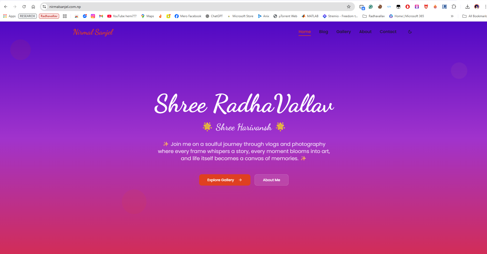
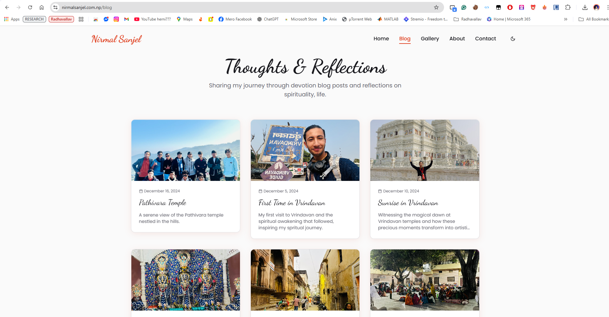

# Nirmal Sanjel – Personal Website

Welcome to my personal website repository! This website showcases my vlogs, photos, and creative projects, built with modern web technologies and personalized design.

🌐 Website URL

Visit My Website: https://nirmalsanjel.com.np/

Fully designed, developed, and maintained by Nirmal Sanjel.

## 🖌 About This Website

This is a personal, portfolio-style website featuring:

```bash
Vlogs & Stories – Interactive 3D card effect for each vlog post

Photo Gallery – Upload and display your best moments

Responsive Design – Works seamlessly on mobile, tablet, and desktop

Creative UI – Handcrafted with Tailwind CSS and shadcn-ui components
```

## ⚡ Features

```bash
Dynamic 3D card hover effect for engaging content

Fully personal and customized to reflect my creative style

Optimized for performance and smooth user experience
```

## 💻 Built With
```bash

React + TypeScript

Tailwind CSS + shadcn-ui

Firebase (Firestore & Storage)

Vite (Fast development & build tools)

AOS (Animate on scroll for smooth transitions)
```

## 📸 Screenshots

Here are some highlights from the website:

### Homepage


### Vlogs Section



## 📜 License & Copyright

All content, design, and code are 100% created and owned by Nirmal Sanjel.
You may view this repository freely, but cannot copy, redistribute, or claim as your own without my permission.
```bash
© NIRMAL SANJEL - All rights reserved.
```#
